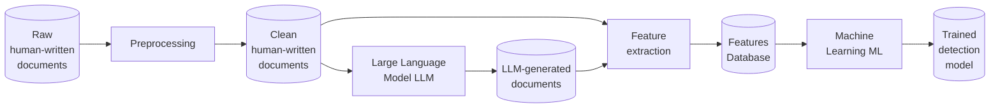
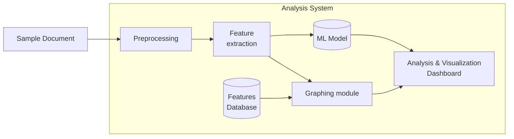

# 🍍 ANANAS Project

The **ANANAS** project (pl. *System do ANAlizy dokumeNtów wspomagający wykrywAnie tekStów wygenerowanych przez modele językowe*, in English: System for document analysis supporting the detection of texts generated by language models) project
is funded by the Warsaw University of Technology (WUT) within the Excellence Initiative: Research University (IDUB) program. 
It aims to develop a document analysis system that supports the detection of LLM-generated texts. 

---

## Project Overview

The **ANANAS** project is designed to allow analyzing text documents and to detect LLM-generated (LLMG) content.  
Our approach is **feature extraction–driven** to fulfill three core requirements:

1. **Assistive, not authoritarian** — ANANAS supports human judgment rather than replacing it.  
2. **Explainable results** — every classification is accompanied by interpretable metrics and reasoning.  
3. **Reproducibility** — results are based on deterministic feature calculations, ensuring consistent outputs.

Instead of giving only a binary ``human vs. AI'' classification, ANANAS computes a set of metrics for each document, compares them to a trained baseline, and presents:
- A preliminary classification (e.g., *human-written* or *LLMG-generated*) along with a confidence score
- Visual explanations highlighting the most influential text features

The **final decision** always rests with the human user, supported by **transparent, reproducible evidence**.

---

## System components

The ANANAS ecosystem is organized into three main environments:

- **`qa`** – Quality assurance and testing environment for evaluating new ideas before production.  
- **`prod`** – Production-ready deployments of the ANANAS system.  
- **`lab`** – Research sandbox for experimental processing and prototyping.  

For repositories with the `ananas-app-` prefix, the `qa` and `prod` environments are **maintained as separate branches** within the same repository:
- `master` branch → **prod**
- `qa` branch → **quality assurance**

Laboratory work is developed in separate `ananas-lab-*` repositories to completly separate it from QA or production.

---

## System Workflow

**Laboratory setup**

**Analysis worklfow**

